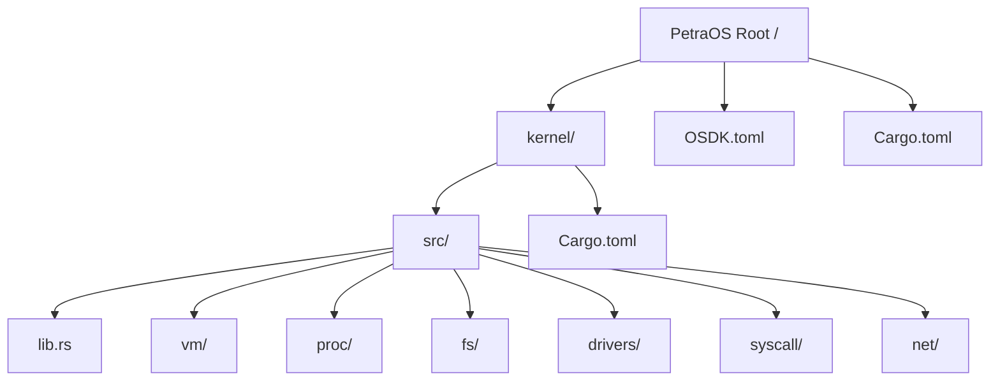

# Agent Coding Guidelines: Safety Barriers, Readability, & Architecture

Welcome! This guide outlines the folder structure, architectural layering, and development rules for AI coding agents and human developers working on **PetraOS**. 

PetraOS is built using the **Asterinas OSDK (Operating System Development Kit)** and follows the **Framekernel Architecture** to guarantee memory safety and robust intra-kernel privilege separation.

---

## 🛡️ Safety Barrier: Safe-by-Design Kernel

To prevent memory safety vulnerabilities (such as use-after-free, double free, or buffer overflows), the PetraOS kernel enforces a compile-time safety barrier:

> [!IMPORTANT]
> The kernel crate is strictly configured to deny all unsafe code.
> At the top of [kernel/src/lib.rs](file:///home/ananta/PetraOS/kernel/src/lib.rs), you will find:
> ```rust
> #![deny(unsafe_code)]
> ```
> **Do not remove this directive.** Any pull request or agent modification that introduces `unsafe` blocks into the kernel crate will fail compilation.

### The Framekernel Architecture:
*   **The OS Framework (`ostd`):** Contains the necessary `unsafe` Rust code to interact with hardware, wrapped behind safe, high-level abstractions.
*   **The OS Services (PetraOS Kernel):** Written entirely in **Safe Rust**. It resides in [kernel/](file:///home/ananta/PetraOS/kernel/) and utilizes `ostd` as its standard library. It implements file systems, drivers, and process management safely without executing raw hardware instructions or manipulating raw pointers directly.

---

## 📁 Codebase Directory Structure



### Module Descriptions & Responsibilities

| Directory | Responsibility | Safety Boundaries |
| :--- | :--- | :--- |
| **[kernel/src/lib.rs](file:///home/ananta/PetraOS/kernel/src/lib.rs)** | Kernel entrypoint (`kernel_main`) & module declarations. | Enforces `#![deny(unsafe_code)]`. |
| **[kernel/src/vm/](file:///home/ananta/PetraOS/kernel/src/vm/)** | Virtual memory management, page tables, and heap allocation. | Must be self-contained. Lower-level module. |
| **[kernel/src/proc/](file:///home/ananta/PetraOS/kernel/src/proc/)** | Process lifecycle, task scheduling, context switching. | Interacts with `vm` but must not depend on high-level filesystem or syscall details. |
| **[kernel/src/fs/](file:///home/ananta/PetraOS/kernel/src/fs/)** | Virtual filesystem (VFS) interface and filesystem drivers. | Depends on `vm` and `proc` for buffering and locks, but must not depend on `syscall`. |
| **[kernel/src/drivers/](file:///home/ananta/PetraOS/kernel/src/drivers/)** | Hardware drivers (serial, timers, interrupts, etc.) wrapped via `ostd`. | Communicates with hardware only through safe OSTD APIs. |
| **[kernel/src/syscall/](file:///home/ananta/PetraOS/kernel/src/syscall/)** | System call entry points and arguments translation. | High-level module mapping user requests to internal subsystems. |
| **[kernel/src/net/](file:///home/ananta/PetraOS/kernel/src/net/)** | Network stack and socket management. | Interacts with drivers and `proc` for asynchronous operations. |

---

## 🧱 Architectural Layering & Barriers

To keep the codebase maintainable for agents and humans alike, dependencies must strictly flow downwards:

```
┌──────────────────────────────────────────┐
│              syscall                     │
└────────────────────┬─────────────────────┘
                     ▼
┌──────────────────────────────────────────┐
│          fs          │        net        │
└──────────┬───────────┴─────────┬─────────┘
           │   ┌─────────────────┘
           ▼   ▼
┌──────────────────────────────────────────┐
│                 proc                     │
└────────────────────┬─────────────────────┘
                     ▼
┌──────────────────────────────────────────┐
│                  vm                      │
└────────────────────┬─────────────────────┘
                     ▼
┌──────────────────────────────────────────┐
│               drivers                    │
└──────────────────────────────────────────┘
```

### Dependency Rules for Coding Agents:
1. **No Circular Dependencies:** A lower-level module (like `vm` or `drivers`) must **never** import symbols from higher-level modules (like `fs` or `syscall`).
2. **Minimize Public Exports:** Keep module interfaces as small as possible. Use `pub(crate)` instead of `pub` where possible to restrict visibility to within the kernel.
3. **No Direct Hardware Access:** Do not attempt to bypass `ostd` by using assembly blocks or raw port I/O. Always use the safe wrappers provided by the framework.

---

## ✍️ Coding Guidelines for Agents

### 1. Readability & Styling
* **Idiomatic Rust:** Always run `cargo fmt` and `cargo clippy` after making changes.
* **Keep Comments Accurate:** Maintain existing documentation. If you change a function signature, update the corresponding doc comments (`///`).

### 2. Error Handling & Robustness
* **No `panic!` or `unwrap`:** The kernel must be highly resilient. Avoid throwing panics in production code.
* **Use `Result`:** Propagate errors using `Result<T, Error>` so that they can be handled gracefully by calling modules or translated to appropriate system call error codes (e.g., `errno`).

---

## 🎨 Rust-Specific Coding Style Guide

### 1. Naming Conventions (`naming`)
*   **Crates:** Use `lowercase-with-hyphens` (e.g., `petra-kernel`) or standard Rust crate names matching OSDK defaults.
*   **Modules:** Use `snake_case` (e.g., `proc`, `vm`).
*   **Structs, Enums, & Traits:** Use `UpperCamelCase` (e.g., `ProcessManager`, `VmSpace`).
*   **Variables, Functions, & Methods:** Use `snake_case` (e.g., `get_process`, `alloc_page`).
*   **Constants & Statics:** Use `SCREAMING_SNAKE_CASE` (e.g., `MAX_CPU_COUNT`).
*   **Boolean Names:** Always use positive assertions with a prefix like `is_`, `has_`, or `can_` (e.g., `is_ready`, `has_permission`). Avoid negative boolean names (e.g., use `is_valid` instead of `is_not_invalid`).
*   **Avoid Cryptic Abbreviations:** Prefer descriptive names over abbreviations, unless they are standard mathematical/system shorthand (e.g., prefer `context` over `ctx`, `address` over `addr` unless `Addr` is a distinct type).

### 2. Crates and Modules (`crates-and-modules`)
*   **Encapsulation:** Keep module internals private. Restrict visibility to `pub(crate)` where possible to enforce strong component boundaries.
*   **Logical Grouping:** Place independent sub-components in submodules under clear parent modules (e.g., keeping filesystem drivers inside [kernel/src/fs/](file:///home/ananta/PetraOS/kernel/src/fs/)).

### 3. Types and Traits (`types-and-traits`)
*   **Single Responsibility:** Each structure or type should represent a single abstraction.
*   **Deriving Standard Traits:** Implement or derive standard traits like `Debug`, `Clone`, `Default` for types when appropriate.
*   **Avoid Premature Abstractions:** Do not create a trait if there is only a single struct implementing it, unless decoupling across crate boundaries is explicitly required.
*   **Newtype Pattern:** Wrap primitive types in newtypes (e.g., `struct PageAddr(usize);`) to prevent mixing up incompatible units (e.g., physical vs. virtual addresses).

### 4. Functions and Methods (`functions-and-methods`)
*   **Focused Scope:** Keep functions concise and dedicated to a single task.
*   **Minimal Arguments:** Minimize parameter counts (ideally 3 or fewer). Group related parameters into structures if necessary.
*   **Fallible Functions:** Always return `Result<T, Error>` for fallible operations. Never throw panics or call `unwrap()` inside kernel routines.
*   **Ownership Pass:** Pass parameters by reference (`&T` or `&mut T`) unless the function explicitly requires taking ownership of the resource.

### 5. Attributes and Macros (`attributes-and-macros`)
*   **Compiler Directives:** Maintain `#![deny(unsafe_code)]` at the root of the kernel crate.
*   **Prudent Macro Usage:** Avoid defining custom declarative or procedural macros unless they drastically reduce boilerplate code.
*   **Inlining:** Use `#[inline]` prudently for short, hot getters or utility functions, but avoid over-inlining large routines.

### 6. Comments and Documentation (`comments`)
*   **Document Public APIs:** All public structs, enums, traits, functions, and constants must have standard `///` doc comments.
*   **Focus on 'Why':** Explain the design decisions, assumptions, and algorithm rationale in comments rather than describing what the code is doing.
*   **TODO Annotation:** Always attribute `TODO` comments to the author or issue (e.g., `// TODO(agent): support multiple page sizes`).